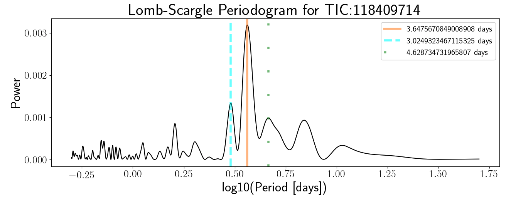

 

<h1>LightCurveStats</h1>
 

<h5>tools for collecting light curve statistics to narrow target sample searches</h5>
 
 
<!-- 
 
 
 -->

 

# Description

Tools for collecting the following light curve statistics for preliminary target sample size reduction or identification: R_var, Lomb-Scargle (LS) Periodogram top three power amplitudes with corresponding rotation periods, Box-Least-Squares (BLS) orbital period, highest power amplitude, transit_depth, transit_duration, transit_time. Can be used with light curve data (time, flux, flux_err arrays) from any instrument, but has been optimized for TESS 2-minute cadence targets with Teff <6500 K. A Light Curve is a time-series dataset of stellar flux observations. Contains example notebooks for downloading TESS 2-minute cadence data by sector and gathering stellar parameters from the TESS Input Catalog. Note that currently these tools are for preliminary sample reduction purposes only. Future updates will validate output statistic precisions. Current pipeline has suggested accuracy based on Kepler vetted catalogs as shown at bottom of the example notebook.

# Example Usage
Follow guide in `download_data` notebook to obtain data, download .py files and use run.py files to calculate light curve statistics in a DataFrame. 
To narrow a search for planet hosting stars while avoiding eclipsing binaries: Use collected statistics to isolate targets with high BLS power amplitudes but low R_var with different period values from BLS and LS, to increase potential sample of magnetically stable stars with transit detections. 

# Dependencies
- astropy
- glob
- lightkurve
- matplotlib
- numpy
- os
- pandas
- scipy
- starspot
- time
- tqdm
